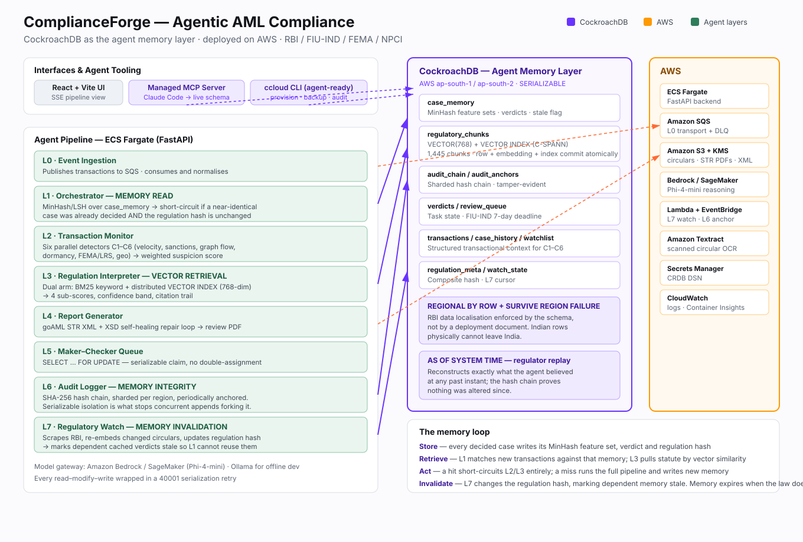

# ComplianceForge

**Agentic AML compliance for Indian fintech, with CockroachDB as the agent memory layer, on AWS.**

[](LICENSE)

An eight-layer agentic pipeline that ingests financial transactions, scores them
for suspicious activity, retrieves the governing regulation, and files FIU-IND
goAML **Suspicious Transaction Reports** — remembering every case it has already
decided, and forgetting them the moment the law changes.



---

## The memory layer

Most agent memory is a transcript. This one is a decision cache with an
expiry condition, and that condition is the law itself.

| Memory operation | Where it happens | What it does |
|---|---|---|
| **Store** | `L1_orchestrator/minhash_lsh.py` → `case_memory` | Every decided case persists its MinHash feature set, verdict, confidence and the regulation hash it was decided under |
| **Retrieve** | `L1_orchestrator/orchestrator.py` | MinHash/LSH Jaccard match against past cases; separately, L3 pulls statute by vector similarity from `regulatory_chunks` |
| **Act** | `run_l1_routing()` | A hit above 0.80 similarity with an unchanged regulation hash **short-circuits L2 and L3 entirely** — the agent skips six detectors and a reasoning call because it already knows the answer |
| **Invalidate** | `L7_regulatory_watch/main.py` → `store.invalidate_stale_cases()` | When RBI publishes a circular, L7 re-embeds it and rewrites the composite regulation hash, marking every dependent cached verdict stale |

That last row is the part that matters. An AML agent that reuses a verdict
reached under a superseded regulation is not efficient, it is
non-compliant. Memory has to expire when the law does, and the invalidation is
a single serializable transaction: the hash update and the cache invalidation
commit together, so there is no window where the agent can short-circuit against
reasoning that is already out of date.

## CockroachDB features used

**1. Distributed Vector Indexing** — `regulatory_chunks` stores 1,445 statute
chunks as native `VECTOR(768)` with a `VECTOR INDEX (regulator, embedding)`.
This replaced a ChromaDB + Azure AI Search split. The chunk row, its embedding
and the index now commit in one transaction, which closes a real staleness
window: previously a crash between the two writes left L3 reasoning against a
circular one store had already superseded.
→ `infra/schema.sql`, `aws/vectors.py`

**2. Cloud Managed MCP Server** — Claude Code connects to the live cluster to
inspect schema, check row counts after migration, and `EXPLAIN` the vector
queries during development. Read-only by default.
→ `.mcp.json`

**3. ccloud CLI (agent-ready)** — the cluster, database, SQL user, backup policy
and connection string are all provisioned through `ccloud` with `-o json`, so an
agent parses structured output instead of screen-scraping. The script also
gates on the cluster version, because `VECTOR` requires v25.2+.
→ `scripts/provision_ccloud.sh`

## AWS services used

ECS Fargate (FastAPI backend) · Amazon SQS + DLQ (L0 transport) · Amazon S3 +
KMS (circulars, STR PDFs, goAML XML) · Amazon Bedrock / SageMaker (Phi-4-mini
reasoning) · Lambda + EventBridge (L7 watch, L6 anchor) · Amazon Textract
(scanned circular OCR) · Secrets Manager · CloudWatch.
→ `infra/main.tf`, `aws/`

## Why serializable isolation is load-bearing

Two places where the default isolation level is the whole design:

- **The audit hash chain (L6).** Two concurrent appends cannot both read the
  same head and link to the same `prev_hash` — one hits a 40001 retry. Under
  read-committed that race silently forks the chain, in the one component whose
  entire purpose is being tamper-evident.
- **Maker–checker (L5).** `SELECT … FOR UPDATE` means two reviewers cannot both
  claim the same role on the same case.

And `AS OF SYSTEM TIME` gives regulator replay: `store.verdict_as_of(tx_id, ts)`
reconstructs exactly what the agent believed at a past instant, while the hash
chain proves nothing was altered since. *"Why did you file this STR on 14 March"*
becomes a query.

## Quickstart

```bash
git clone <this-repo> && cd ComplianceForge
pip install -r requirements.txt
cp .env.example .env

./scripts/provision_ccloud.sh                    # cluster + DB + user + DSN into .env
cockroach sql --url "$CRDB_DSN" -f infra/schema.sql
python scripts/seed_crdb.py                      # 2000 txns, 1662 accounts, 76k history legs
python scripts/seed_regulatory_chunks.py         # 1445 chunks with their 768-dim vectors
python scripts/verify_parity.py --limit 200      # regression gate

uvicorn api:app --reload --port 8000
cd regulatory-ui-react && npm install && npm run dev
```

Step-by-step setup including credentials: [`SETUP.md`](SETUP.md).
Full migration record and gotchas: [`PORT_NOTES.md`](PORT_NOTES.md).

---

## Architecture

Transactions flow through the layers in order. Each layer enriches a shared
`CaseState` object that carries the transaction, its scores, evidence, and an
append-only audit chain.

| Layer | Name | Responsibility |
|-------|------|----------------|
| **L0** | Event Ingestion | Reads transactions from CockroachDB and publishes each row as JSON to Amazon SQS (`tx-events`); also exposes a receiver for L1. |
| **L1** | Orchestrator | Consumes events, builds the initial `CaseState`, checks case memory via **MinHash/LSH** de-duplication and regulation-hash staleness, and drives L2 → L3 → L4. |
| **L2** | Transaction Monitor | Runs six parallel detectors (**C1–C6**) and combines them into a single weighted suspicion score. |
| **L3** | Regulation Interpreter | Dual retrieval over `regulatory_chunks` — BM25 keyword arm and native CockroachDB vector arm — then model-based legal reasoning producing sub-scores and a verdict. Includes a maker/checker step. |
| **L4** | Report Generator | Maps the verdict + evidence into a constrained JSON object, serializes a goAML **TransactionBasedReport** STR XML, and validates it against the XSD + FIU preliminary rules (with an SLM repair loop). Renders a review PDF. |
| **L6** | Audit Logger | Appends each outcome to a tamper-evident **hash chain** in CockroachDB, sharded per region and periodically anchored. Serializable isolation is what prevents the chain forking under concurrent appends. |
| **L7** | Regulatory Watch | EventBridge-scheduled job that scrapes regulatory sources, OCRs via Textract, classifies changes, re-indexes the corpus, and updates the regulation hash — which invalidates cached verdicts so L1 cannot short-circuit against stale reasoning. |

### L2 detectors (C1–C6)

| Check | Detector | Weight |
|-------|----------|--------|
| C1 | Velocity & structuring | 0.15 |
| C2 | Sanctions & watchlist | 0.20 |
| C3 | Graph / network flow | 0.10 |
| C4 | Account risk & dormancy | 0.35 |
| C5 | FEMA / LRS limits | 0.10 |
| C6 | Geo anomaly | 0.10 |

The aggregator is intentionally defensive — each detector is imported safely,
awaited if async, and any failure contributes `0.0` rather than breaking the run.

---

## Tech stack

- **Backend / pipeline:** Python, FastAPI, LangGraph, Pydantic
- **Database:** CockroachDB (v25.2+) — transactions, case memory, verdicts, review queue, regulation corpus and audit chain all in one store
- **Retrieval:** CockroachDB native `VECTOR` index (C-SPANN) + `rank-bm25`; `rapidfuzz`, `datasketch` (MinHash/LSH)
- **Models:** Amazon Bedrock or SageMaker (Phi-4-mini), with Ollama for offline dev — one gateway, `aws/model_gateway.py`
- **Reporting:** `lxml` (XSD validation), `reportlab` / `jinja2` (PDF)
- **AWS:** S3, SQS, Secrets Manager, KMS, ECS Fargate, Lambda + EventBridge, Textract, CloudWatch
- **Frontend:** React 18 + Vite (`regulatory-ui-react/`)

---

## Getting started

### Prerequisites

- Python 3.10+
- Node.js 18+ (for the UI)
- A CockroachDB cluster, **v25.2 or later** (the `VECTOR` type does not exist below that)
- [Ollama](https://ollama.com/) running locally (optional, for offline model inference) — otherwise set `MODEL_BACKEND=bedrock`

### 1. Backend

```bash
# Install Python dependencies
pip install -r requirements.txt

# Configure environment
cp .env.example .env   # set CRDB_DSN at minimum

# Create the schema
cockroach sql --url "$CRDB_DSN" -e "CREATE DATABASE complianceforge"
cockroach sql --url "$CRDB_DSN" -f infra/schema.sql

# Load the data
python scripts/seed_crdb.py                # transactions, accounts, history, watchlist
python scripts/seed_regulatory_chunks.py   # 1445 chunks, 768-dim vectors, bundled seed file

# Confirm the port did not change detector output
python scripts/verify_parity.py --limit 200

# Run the API
uvicorn api:app --reload --port 8000
```

### 2. Frontend

```bash
cd regulatory-ui-react
npm install
npm run dev
```

The UI talks to the FastAPI backend at `http://localhost:8000`.

### 3. Demo data

```bash
# Seed curated demo cases so each flagged sample shows a real STR PDF
python seed_demo_strs.py
```

---

## API

The FastAPI backend (`api.py`) bridges the React frontend and the L0–L4 pipeline:

| Method | Endpoint | Purpose |
|--------|----------|---------|
| `POST` | `/api/transactions/stream` | Stream a transaction through the full pipeline (SSE) |
| `POST` | `/api/publish` | Publish transactions to the queue |
| `GET`  | `/api/queue/status` | Queue length / status |
| `POST` | `/api/debug` | Inspect intermediate pipeline output |
| `GET`  | `/api/health` | Health check — reports CockroachDB, queue, S3 and model backend status |

Generated STR review PDFs are served from `/reports`.

---

## Configuration

Settings are read from environment variables via `config.py` (see `Config`).
Key groups:

- **CockroachDB** — `CRDB_DSN`, `CRDB_POOL_MAX`. The single source of truth.
- **AWS** — `AWS_REGION`, `S3_BUCKET`, `SQS_QUEUE_URL`, `S3_KMS_KEY_ID`
- **Models** — `MODEL_BACKEND` (`bedrock` | `sagemaker` | `ollama`), plus `BEDROCK_MODEL_ID` or `SAGEMAKER_GEN_ENDPOINT`
- **Embeddings** — `EMBED_BACKEND`. Must stay on nomic-embed-text: the corpus is `VECTOR(768)` nomic, so another model means a schema edit and a full re-embed.
- **L7** — `TEXTRACT_ENABLED` for scanned circulars
- **Pipeline** — `FIU_IND_DEADLINE_DAYS`, seed CSV paths, valid channels (`UPI`, `NEFT`, `RTGS`, `IMPS`, `SWIFT`)

`infra/main.tf` provisions S3 + KMS, SQS + DLQ, Secrets Manager, ECS, IAM and the
EventBridge schedules. `infra/setup-env.sh <prefix>` writes the resulting bucket
and queue into `.env`. The CockroachDB cluster is provisioned outside Terraform.

> **Note:** Datasets under `data/` and secrets (`.env`, `local.settings.json`)
> are git-ignored. The bundled `TransactionBasedReport_POC.xsd` uses POC
> placeholder enum codes — swap in the real FIU-IND Lookup Master values for production.

---

## Repository layout

```
.
├── aws/                      # CockroachDB, S3, SQS, model gateway
├── scripts/                  # Seed, parity-check
├── L0_event_ingestion/       # CockroachDB → SQS publisher + receiver
├── L1_orchestrator/          # Case orchestration, MinHash/LSH, regulation hashing
├── L2_transaction_monitor/   # Six detectors (C1–C6) + weighted aggregation
├── L3_regulation_interpreter/# Hybrid retrieval + LLM legal reasoning + maker/checker
├── L4/                       # goAML STR generator + XSD/rule validation
├── L6_audit_logger/          # Tamper-evident hash chain (CockroachDB)
├── L7_regulatory_watch/      # Regulatory source scraper/classifier/indexer
├── regulatory-ui-react/      # React (Vite) frontend
├── infra/                    # Terraform + schema.sql + env setup
├── reports/                  # Generated STR review PDFs
├── api.py                    # FastAPI backend
├── config.py                 # Central configuration
├── seed_demo_strs.py         # Demo case seeder
└── requirements.txt
```

> **Note:** There is no `L5` directory in this repo. L5 (human escalation /
> maker-checker review) is referenced as a routing target and is now backed by
> the `review_queue` table with `store.claim_review()`, but has no UI yet.

See `PORT_NOTES.md` for the full Azure → AWS/CockroachDB migration record.
